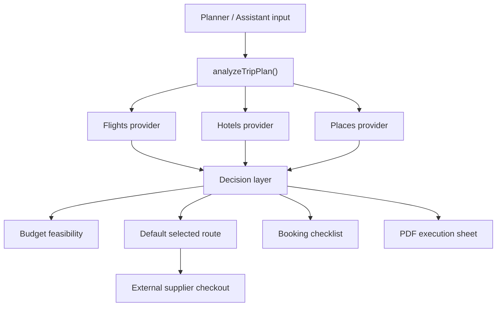

# CEO REVIEW SUMMARY

Project: Katris Travel AI
Date: 2026-07-04
Mode: SELECTIVE EXPANSION
Review target: Remaining commercial execution flow after budget/provider transparency layer

## Premise Challenge

The right problem is no longer "make the assistant answer better." The user-facing problem is:

> Can Katris turn an uncertain travel request into a concrete, credible execution path without forcing the user to think through supplier uncertainty?

If the product only returns text, it competes with ChatGPT. If it returns selected options, visible constraints, external booking links, and a final execution PDF, it becomes a lightweight travel operating layer.

## Current State -> This Plan -> 12-Month Ideal

CURRENT STATE:
- Static/Vercel app with planner, assistant, hotel/flight/place APIs, PDF, provider labels, budget feasibility.
- Real provider results exist, but booking ownership remains external.
- State is local/browser-only.

THIS PLAN:
- Finish the execution loop: default selections, confirmed itinerary cards, map-ready route anchors, provider status, PDF.
- Keep payment on original suppliers.
- Avoid fake inventory claims.

12-MONTH IDEAL:
- Katris stores user trips, remembers selected suppliers, tracks booking status, generates shareable execution documents, and routes users to paid supplier/affiliate checkout.

## Alternatives

### 1. Minimal Viable Closure

Summary: Finish visible user trust gaps only.
Effort: M
Risk: Low

Pros:
- Fastest path to a coherent demo.
- Reuses current `analyzeTripPlan()`, provider cards, PDF, and budget layer.
- Avoids another API migration cycle.

Cons:
- Still local-state only.
- No booking persistence.
- No proper analytics.

Reuses:
- `deriveBudgetFeasibility()`
- `deriveFlightDecisions()`
- hotel/place/flight provider calls
- PDF generation

### 2. Recommended: Commercial Execution Loop

Summary: Keep current UI/backend, add default final selections, map route anchors, booking action states, stronger slow-loading behavior, and deploy QA.
Effort: L
Risk: Medium

Pros:
- Best fit for the user's current product goal.
- Makes external booking/payment feel intentional rather than incomplete.
- Still avoids claiming live inventory Katris does not own.

Cons:
- Requires careful UX copy.
- Can still be slow if Apify/hotel providers delay.
- Needs QA across several city types.

Reuses:
- Existing planner and assistant flow
- Current provider integrations
- Current booking checklist
- Current PDF generation

### 3. Ideal Architecture

Summary: Add provider orchestration service, cache, persisted trips, account system, analytics, and affiliate tracking.
Effort: XL
Risk: High

Pros:
- Real product foundation.
- Supports commercial metrics and user retention.
- Easier to scale providers later.

Cons:
- Too large before demo validation.
- Requires database/auth/analytics decisions.
- Could delay the current launch by weeks.

Reuses:
- Current provider normalization as prototype logic.

Recommendation: Continue with Alternative 2.

## Architecture Review

Architecture challenge: the app now has many client-side responsibilities in `script.js`. That is acceptable for this stage, but the next step should be narrow and not turn into a broad refactor.

## Error & Rescue Map

- `hotel_provider_timeout`: show last available external links and label them as original-platform confirmation required.
- `flight_provider_empty`: keep route card, show external flight choices, do not say live fare.
- `places_provider_empty`: use verified city fallback if known; otherwise show map search links with clear status.
- `budget_infeasible`: show a recommended adjustment path instead of only warning.
- `ai_provider_unavailable`: use structured fallback; do not surface provider names.
- `pdf_generation_blocked`: allow Draft PDF and mark unconfirmed items.

## Security & Threat Model

Secrets must remain server-side. The most important user-facing security issue is not token exposure in UI; it is trust exposure: fake certainty. Every supplier result must make clear whether Katris can confirm it or whether the original supplier must confirm it.

## Data Flow & Edge Cases

Happy path:
User input -> parse -> provider search -> normalized data -> default choices -> budget check -> itinerary cards -> external booking/PDF.

Shadow paths:
- Empty budget: do not block planning; mark budget as unknown.
- Empty provider result: external links remain selectable.
- Wrong city parsing: preserve user's raw input in assistant context.
- Slow provider: show staged progress, not a generic spinner.
- User changes planner after results: previous selected flights/checklist must reset or clearly become stale.

## Code Quality Review

The biggest code risk is `script.js` size. Do not solve that now. The next implementation should be additive and tested:

- `deriveDefaultTripSelections()`
- `renderSelectedPlanSummary()`
- `buildMapRouteUrl()`
- `getStaleSelectionStatus()`

Avoid moving large blocks until the current demo is stable.

## Test Review

Existing contract tests are useful. Add the next tests before implementation:

- A route with hotel + flight returns one recommended execution path.
- Budget overrun produces a default adjustment.
- Provider failure still produces external booking choices.
- Changing planner input clears or invalidates selected booking state.
- User-facing text contains no internal hook/provider labels.

## Observability & Monitoring

Current observability is still mostly manual. Minimum next layer:

- visible provider status per section
- console-free browser QA
- production smoke test route
- provider result count checks

Deferred:
- dashboard
- fallback-rate metrics
- provider latency metrics
- alerting

## Database & State Management

No database should be added in the next step. Browser state is acceptable until the execution loop is credible. Persistence becomes important after the demo can reliably produce a strong plan.

## API Design & Contract

No new API route is required for the next step. Use current normalized results. Adding another supplier now is less valuable than making the current supplier data feel decisive.

## Performance & Scalability

The critical performance issue is hotel/API latency. Next implementation should improve perceived performance:

- staged loading labels
- partial section readiness
- no blocking UI freeze

Caching is deferred unless repeated QA is too slow.

## Design & UX Review

The product should stop asking the user to make obvious decisions. It should say:

- Recommended hotel area
- Recommended flight option
- Recommended first-day rhythm
- Why budget is feasible or not
- What must be confirmed on supplier site

Avoid:

- "needs confirmation" everywhere
- engineering/provider names
- vague fallback language
- asking users to pick when Katris has enough information to choose

## Strongest Challenges

1. The app still needs a default execution path, not just option lists.
2. State can become stale when the user edits route/budget after generating results.
3. External booking must feel like a product decision, not a missing feature.

## Recommended Next Implementation

Build the "Recommended Execution Path" layer:

1. Select one recommended flight per flight segment when possible.
2. Select one recommended hotel per city when possible.
3. Select 3-5 concrete day anchors from verified places.
4. Show one concise "Recommended Plan" summary above the option lists.
5. Mark external supplier checkout clearly.
6. Invalidate old selections when planner inputs change.

## Accepted Scope

- Default selections
- Stale selection handling
- Recommended plan summary
- External checkout clarity
- Tests and browser QA

## Deferred

- New suppliers
- Auth/database
- Payment inside Katris
- Analytics dashboard
- Major file refactor

## NOT In Scope

- Claiming Katris owns final hotel inventory.
- Hiding supplier confirmation requirements.
- Rewriting the visual design again.
- Adding more API platforms before the current execution flow is coherent.

Status: DONE_WITH_CONCERNS
